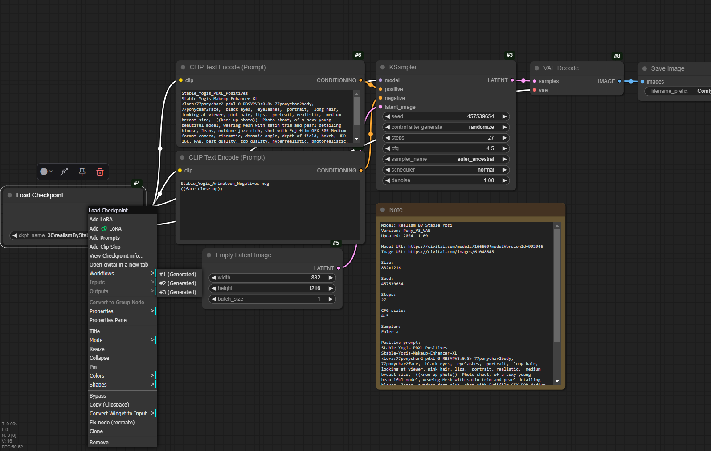

# comfyui-model-workflows

Load model creator's workflow.

## Usage

When you first start after install extension, it will take a few minutes to initialize.  

  

1. Right click on Load checkpoint node  
2. "Workflows"
3. Select the workflow you want to load

## References  

- [civitai-model-json](https://github.com/shinich39/civitai-model-json)